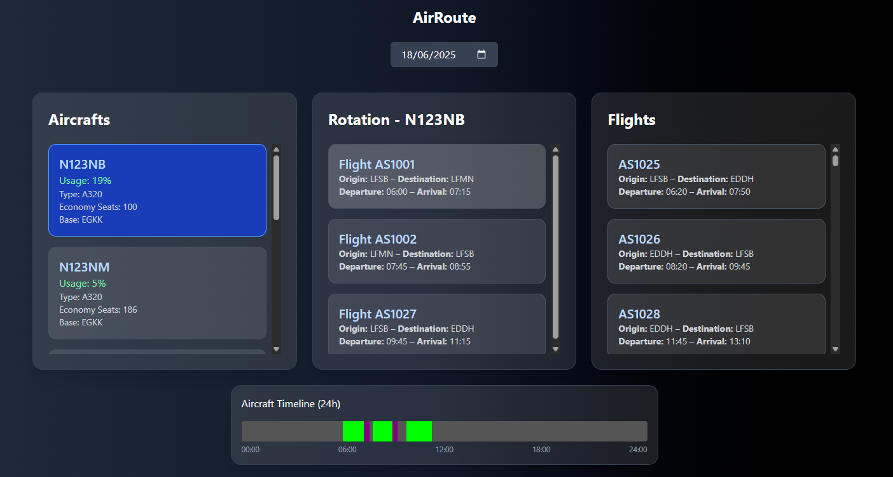

<p align="center">
  
</p>

<h1 align="center">AirRoute</h1>

This application was developed to manage aircraft flight rotations. The goal is to display a list of aircraft, show their scheduled flights per selected date, allow adding/removing flights from rotations, and visualize aircraft utilization.

## 🚀 Features

- 🛩️ **Aircraft List**: Displays all aircraft with details and utilization percentage per selected date.
- 📅 **Date Selection**: Choose a date to view or manage flights scheduled for that day.
- 🔄 **Flight Rotation**: View, add, and remove scheduled flights for a selected aircraft on a chosen date.
- 📋 **Available Flights**: Shows flights available to add to the rotation that don’t conflict with existing schedule.
- 📊 **Utilization Calculation**: Calculates and shows aircraft utilization as percentage of 24 hours based on scheduled flight + turnaround times.
- 📅 **Flight Timeline**: Visual horizontal bar representing scheduled flights, turnaround, and idle times (planned feature).

## 🛠️ Technologies Used

- **Frontend**: React.js, TypeScript, TailwindCSS  
- **State Management**: React Hooks and useEffect  
- **Date Management**: dayjs  
- **Storage**: Browser LocalStorage for persistence  
- **Event Communication**: Custom window events to synchronize components  

## 📂 Project Structure

```
airroute/
│-- src/
│ │-- components/
│ │ │-- AircraftList/ # Aircraft list and utilization
│ │ │-- FlightList/ # Flights available to add
│ │ │-- Rotation/ # Flights scheduled for selected aircraft/date
│ │ │-- AircraftTimeline/ # Visual timeline of flights (planned)
│ │-- services/ # API or local data fetching services
│ │-- App.tsx # Main application component
│-- public/ # Static assets
│-- index.css # Global styles
│-- package.json # Project metadata and dependencies
│-- README.md # Project documentation
```

## 🎯 How to Run the Application

1. Clone the repository:

   ```sh
   git clone https://github.com/leclm/airroute.git
   cd airroute
   ```

2. Install dependencies:

   ```sh
   npm install
   ```

3. Start the development server:

   ```sh
   npm run dev
   ```

4. Open the app in your browser at [http://localhost:5173](http://localhost:5173)

## 📸 Screenshot

Home


## 🛠️ Data Structure
The application stores flight rotations per aircraft and date in localStorage in the following format:

```json
{
  "rotation-by-aircraft": {
    "N12345": {
      "2025-06-18": [
        {
          "ident": "FL123",
          "origin": "JFK",
          "destination": "LAX",
          "readable_departure": "09:00",
          "readable_arrival": "12:00"
        },
        {
          "ident": "FL124",
          "origin": "LAX",
          "destination": "SFO",
          "readable_departure": "12:30",
          "readable_arrival": "13:30"
        }
      ]
    }
  }
}
```

## 🌐 External APIs

- **Aircrafts API**  
  Fetches the list of available aircraft.  
  `GET https://recruiting-assessment.alphasights.com/api/aircrafts`

- **Flights API**  
  Fetches the full list of flights to be scheduled.  
  `GET https://recruiting-assessment.alphasights.com/api/flights`

---

> This project was developed by **[@Letícia Lima](https://www.linkedin.com/in/leticiachagaslima/)**, as a way to improve my knowledge and practice 💜

---

<div align="center">

[](https://www.linkedin.com/in/leticiachagaslima/)

</div>
